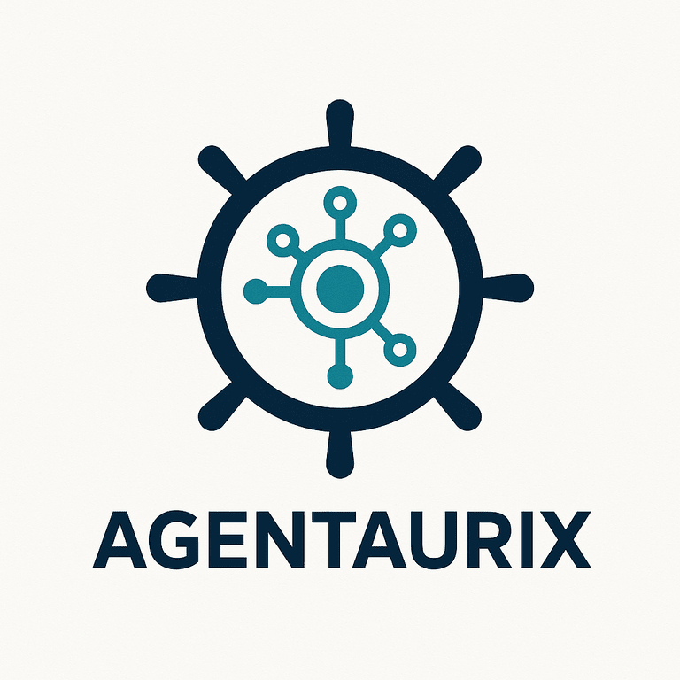

  

# AgentAurix

**AI Agents and LLM-Powered Vision Systems for Energy and Autonomy**

AgentAurix builds intelligent systems that bring automation, safety, and real-time decision-making to the energy sector — from offshore infrastructure to edge intelligence in harsh environments.

---

## About

We design and deploy:

- LLM-integrated vision systems for energy operations  
- AI agents for real-time anomaly detection, diagnostics, and safety  
- Scalable MLOps pipelines for deploying AI models on embedded and edge devices  

While our foundations include maritime expertise, our core focus is now on delivering advanced AI solutions tailored to the energy industry's unique operational challenges.

---

## Collaboration

We collaborate with forward-thinking energy operators, industrial technology firms, and research labs.  
If you’re building the future of energy with AI, we’re ready to contribute.

---

## Contact

Website: [www.agentaurix.com](https://www.agentaurix.com)  
Email: contact@agentaurix.com  
GitHub: [github.com/agentaurix-org](https://github.com/agentaurix-org)

---

AgentAurix — Advancing energy intelligence through AI. 
